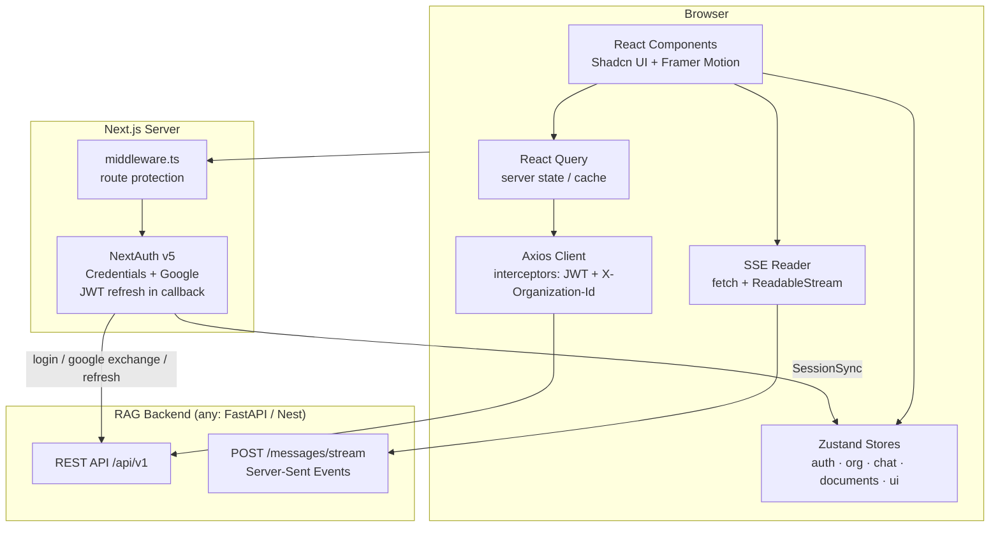

# Cortex — Multi-Tenant AI RAG SaaS Frontend

A production-ready frontend for a multi-tenant Retrieval-Augmented-Generation platform (think ChatPDF × Notion AI × Perplexity). Upload documents per organization, chat with them via streaming AI responses, and get citation-backed answers.

**Stack:** Next.js 15 (App Router) · TypeScript · Tailwind CSS v4 · Shadcn UI · Zustand · TanStack React Query · NextAuth v5 · Axios · Framer Motion · Recharts

---

## Quick start

```bash
npm install
cp .env.example .env.local   # fill in AUTH_SECRET, Google OAuth keys, API URL
npm run dev                  # http://localhost:3000
```

The frontend expects a backend at `NEXT_PUBLIC_API_URL` (default `http://localhost:8000/api/v1`). The full API contract it consumes is defined in `src/lib/api/*.ts`.

---

## System design



### Multi-tenancy model

- Every API request carries `Authorization: Bearer <jwt>` **and** `X-Organization-Id: <active org>` — attached automatically by the Axios request interceptor ([client.ts](src/lib/api/client.ts)).
- React Query keys are **scoped by org id** (`["documents", orgId, …]`), so switching organizations never leaks another tenant's cached data. Switching also calls `queryClient.invalidateQueries()` ([org-switcher.tsx](src/components/layout/org-switcher.tsx)).
- Role gates (`ADMIN ≥ EDITOR ≥ VIEWER`) are enforced in the UI via `hasRole()` ([org-store.ts](src/stores/org-store.ts)) — the backend remains the source of truth.

### Auth flow

1. **Credentials / Google** sign-in goes through NextAuth v5 ([auth.ts](src/lib/auth.ts)). Google sign-ins exchange the Google ID token for backend-issued JWTs (`POST /auth/google`).
2. Backend `accessToken` / `refreshToken` ride inside the NextAuth JWT; the `jwt` callback silently refreshes 60s before expiry.
3. [SessionSync](src/providers/session-sync.tsx) mirrors the session into the Zustand auth store so the Axios client can read tokens synchronously.
4. As a second safety net, the Axios response interceptor catches 401s, performs a **single-flight** refresh, retries the original request, and logs out on failure.
5. [middleware.ts](src/middleware.ts) redirects unauthenticated users to `/login?callbackUrl=…` and authenticated users away from auth pages.

### Chat streaming

`EventSource` can't send auth headers, so streaming uses `fetch` + `ReadableStream` against `POST /conversations/:id/messages/stream`, parsing SSE frames (`token`, `citations`, `done`, `error`) — see [chat.ts](src/lib/api/chat.ts). Tokens flow into the **chat store** (not React Query — token-by-token updates are client state), with an `AbortController` powering the Stop button and an optimistic user-message + assistant-placeholder pattern in [use-chat.ts](src/hooks/use-chat.ts).

---

## Folder structure

```
src/
├── app/
│   ├── (auth)/                      # public, centered-card layout
│   │   ├── login/  register/  forgot-password/
│   │   └── layout.tsx               # split brand/form panels
│   ├── (dashboard)/                 # protected, sidebar shell
│   │   ├── dashboard/               # overview stats + activity feed
│   │   ├── documents/               # upload + list + search + delete
│   │   ├── chat/                    # conversation sidebar layout
│   │   │   ├── [conversationId]/    # streaming chat view
│   │   │   └── page.tsx             # "new chat" empty state
│   │   ├── analytics/               # charts (range-switchable)
│   │   ├── settings/
│   │   │   ├── organization/        # rename, plan
│   │   │   └── members/             # invite, role mgmt, removal
│   │   ├── onboarding/              # first-org creation
│   │   └── layout.tsx               # Sidebar + Topbar + ErrorBoundary
│   ├── api/auth/[...nextauth]/      # NextAuth route handlers
│   ├── layout.tsx                   # fonts, metadata, AppProviders
│   └── page.tsx                     # → /dashboard
├── components/
│   ├── ui/                          # Shadcn primitives (generated)
│   ├── auth/                        # login/register/forgot forms, OAuth
│   ├── layout/                      # sidebar, topbar, org-switcher, user-menu,
│   │                                #   theme-toggle, mobile-nav
│   ├── dashboard/                   # stat-card, storage-card, activity-feed
│   ├── documents/                   # upload-dropzone, document-table,
│   │                                #   status-badge, upload-progress-indicator
│   ├── chat/                        # message-bubble, markdown-renderer,
│   │                                #   citation-list, chat-input, copy-button,
│   │                                #   suggested-questions, conversation-list
│   ├── analytics/                   # recharts wrappers
│   ├── organization/                # create-org & invite dialogs, members-table,
│   │                                #   role-select
│   └── shared/                      # empty-state, error-boundary, page-header,
│                                    #   loading-skeletons
├── hooks/                           # React Query hooks per domain + use-debounce
├── lib/
│   ├── api/                         # axios client + endpoint modules + SSE reader
│   ├── auth.ts                      # NextAuth config
│   ├── format.ts                    # bytes/number/date helpers
│   └── utils.ts                     # cn()
├── providers/                       # AppProviders (Query/Theme/Session/Toaster),
│                                    #   SessionSync bridge
├── stores/                          # Zustand: auth, org, chat, document, ui
├── types/                           # shared domain types
└── middleware.ts                    # route protection
```

## State management architecture

| Concern | Owner | Why |
|---|---|---|
| Server data (docs, members, conversations, analytics) | **React Query** | caching, polling, optimistic updates, invalidation |
| Session tokens & user | **Zustand `auth-store`** (persisted) | Axios interceptors need synchronous reads |
| Active org + role helpers | **Zustand `org-store`** (persisted) | tenant header + survives refresh |
| Streaming chat messages | **Zustand `chat-store`** | token-by-token updates don't fit query cache |
| Upload progress | **Zustand `document-store`** | progress bars survive route changes (topbar indicator) |
| Sidebar/mobile nav | **Zustand `ui-store`** | trivial UI state |

Patterns worth noting:
- **Optimistic updates** with rollback: member role changes and document deletion (`onMutate`/`onError`/`onSettled` in [use-organizations.ts](src/hooks/use-organizations.ts), [use-documents.ts](src/hooks/use-documents.ts)).
- **Smart polling**: the document list polls every 4s only while any document is `PROCESSING`/`EMBEDDING`, then stops ([use-documents.ts](src/hooks/use-documents.ts)).
- **Notifications**: Sonner toasts fired from mutation callbacks (upload complete, invites, errors); activity feed refetches every 30s.

## Backend API contract (consumed)

```
POST /auth/login | /auth/register | /auth/google | /auth/refresh
POST /auth/forgot-password | /auth/reset-password
GET  /auth/me

GET/POST       /organizations            PATCH/DELETE /organizations/:id
GET            /organizations/:id/members
POST           /organizations/:id/invitations
PATCH/DELETE   /organizations/:id/members/:memberId

GET/POST /documents      (multipart upload w/ progress)    DELETE /documents/:id

GET/POST /conversations                  DELETE /conversations/:id
GET      /conversations/:id/messages | /suggestions
POST     /conversations/:id/messages/stream        ← SSE

GET /analytics/dashboard | /activity | /overview?range=7d|30d|90d
```

All org-scoped routes read the tenant from the `X-Organization-Id` header.

---

## Roadmap: MVP → production

**Phase 1 — MVP (done in this codebase)**
- Auth (credentials + Google), protected routes, token refresh
- Org CRUD, switching, invitations, role management
- Document upload with progress, processing status polling, search, delete
- Streaming chat with citations, markdown, code highlighting, regenerate/copy/stop
- Dashboard stats + activity, analytics charts, dark/light theme, responsive shell

**Phase 2 — Hardening**
- Move tokens to httpOnly cookies set by the backend (drop localStorage persistence)
- E2E tests (Playwright) for auth, upload, chat; component tests for stores/hooks
- Sentry + analytics instrumentation in `ErrorBoundary` and the Axios client
- Virtualized message list (long conversations) and document table pagination UI
- Real-time processing status via WebSocket instead of polling

**Phase 3 — Growth**
- Billing pages (Stripe), plan limits surfaced in UI (storage card already plan-aware)
- Document preview pane with citation deep-links (jump to page)
- Multi-document chat scoping UI, folders/tags, bulk actions
- Admin audit log, SSO (SAML/OIDC) for enterprise tenants
- i18n, accessibility audit (WCAG 2.1 AA)

---

## Scripts

| Command | Action |
|---|---|
| `npm run dev` | dev server (Turbopack) |
| `npm run build` | production build |
| `npm start` | serve production build |
| `npm run lint` | ESLint |
