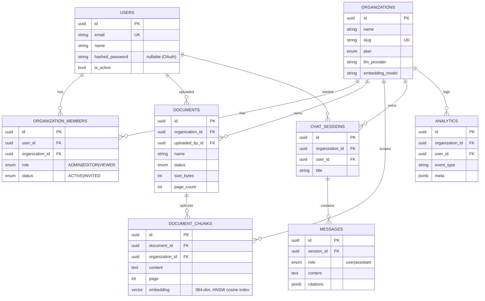

# Cortex Backend — Multi-Tenant AI RAG API

A production-shaped (but student-readable) FastAPI backend for **Cortex**: a
multi-tenant Retrieval-Augmented-Generation platform where organizations upload
documents and ask questions that are answered with cited sources.

**Stack:** FastAPI · Python 3.12 · SQLAlchemy 2.0 (async) · PostgreSQL + pgvector
· JWT + bcrypt · LangChain · Sentence-Transformers · Groq (free) / OpenAI.

---

## 1. Quick start

```bash
cd backend
python -m venv .venv && .venv\Scripts\activate      # Windows
# source .venv/bin/activate                          # macOS/Linux
pip install -r requirements.txt

cp .env.example .env        # then edit DATABASE_URL, JWT_SECRET, etc.

# Postgres must have the pgvector extension available; init_db() runs
# "CREATE EXTENSION IF NOT EXISTS vector" on startup.
uvicorn app.main:app --reload
```

Interactive API docs: **http://localhost:8000/api/v1/docs**

> `LLM_PROVIDER=mock` (the default) runs the entire RAG pipeline with **no API
> key** — embeddings are real, the LLM answer is a deterministic stub. Set
> `LLM_PROVIDER=groq` + a free key from console.groq.com for real answers.

---

## 2. Request flow

```mermaid
sequenceDiagram
    participant FE as Next.js Frontend
    participant MW as CORS + Routers
    participant DEP as Dependencies<br/>(get_current_user → get_tenant → require_role)
    participant SVC as Service Layer
    participant DB as PostgreSQL + pgvector
    participant AI as Embeddings / LLM

    FE->>MW: HTTP + Authorization: Bearer + X-Organization-Id
    MW->>DEP: route matched
    DEP->>DB: decode JWT → load User; verify membership → role
    DEP-->>MW: TenantContext(user, org, role)  (or 401/403)
    MW->>SVC: handler calls service with TenantContext
    SVC->>AI: embed / generate (RAG only)
    SVC->>DB: tenant-scoped queries (always WHERE organization_id = ...)
    DB-->>SVC: rows
    SVC-->>FE: Pydantic response (camelCase JSON)
```

Authentication and authorization are layered as three dependencies:

| Dependency | Question it answers | Failure |
|---|---|---|
| `get_current_user` | *Who are you?* (valid access token) | 401 |
| `get_tenant` | *Are you a member of this org?* (X-Organization-Id) | 403 |
| `require_role(R)` | *Is your role ≥ R?* | 403 |

---

## 3. Folder responsibility

```
backend/app/
├── main.py            # app factory, CORS, lifespan (init_db), router mounting
├── core/
│   ├── config.py      # typed settings from .env (one source of truth)
│   └── security.py    # bcrypt hashing + the authn/tenant/RBAC dependencies
├── db/
│   ├── database.py    # async engine, Base, init_db (extension+tables+HNSW idx)
│   └── session.py     # get_db request-scoped session dependency
├── models/            # SQLAlchemy ORM — the database schema
│   ├── user.py        # User
│   ├── organization.py# Organization, OrganizationMember (RBAC join), Role
│   ├── document.py    # Document, DocumentChunk (embedding vector lives here)
│   ├── chat.py        # ChatSession, Message (+ citations JSON)
│   └── analytics.py   # AnalyticsEvent (append-only event log)
├── schemas/           # Pydantic request/response models (camelCase out)
│   ├── base.py        # CamelModel — snake_case ↔ camelCase bridge
│   ├── auth.py user.py document.py chat.py organization.py analytics.py
├── services/          # business logic — handlers stay thin
│   ├── auth_service.py        # register/login/google/refresh, JWT issuing
│   ├── organization_service.py# org CRUD + members + settings
│   ├── document_service.py    # upload + background ingestion pipeline
│   ├── rag_service.py         # embed → retrieve → prompt → generate
│   ├── chat_service.py        # sessions, messages, blocking + streaming turns
│   └── analytics_service.py   # track_event + aggregate metrics
├── api/               # thin HTTP routers (one per module)
│   ├── auth.py organizations.py documents.py chat.py
│   ├── analytics.py members.py settings.py
└── utils/
    ├── jwt.py         # create/verify access & refresh tokens
    ├── embeddings.py  # SentenceTransformer singleton (threadpool encode)
    ├── chunking.py    # RecursiveCharacterTextSplitter (page-aware)
    └── pdf_parser.py  # pypdf / text / docx extraction
```

**Layering rule:** `api → services → models/db`. Routers never touch the DB
directly; services never parse HTTP. This keeps logic testable and the HTTP
layer trivial.

---

## 4. Database diagram



**Key indexes:** `users.email` (unique), `organization_members(user_id,
organization_id)` (unique), `documents.organization_id`, `document_chunks`
HNSW index on `embedding` (`vector_cosine_ops`), `analytics(organization_id,
created_at)` composite.

**Tenant isolation** is enforced two ways: (1) every domain row carries
`organization_id`, and (2) `get_tenant` proves membership before any handler
runs, so every service query filters by an org the caller actually belongs to.

---

## 5. RAG architecture

```mermaid
flowchart LR
    subgraph Ingestion["Ingestion (background task)"]
        U[PDF / DOCX / TXT upload] --> X[extract_pages<br/>pdf_parser]
        X --> C[chunk_pages<br/>1000 chars / 150 overlap]
        C --> E1[embed batch<br/>MiniLM 384-dim]
        E1 --> S[(document_chunks<br/>pgvector)]
    end

    subgraph Query["Query (per question)"]
        Q[User question] --> E2[embed query]
        E2 --> R["similarity search<br/>cosine_distance, top-5<br/>WHERE org_id = tenant"]
        S -.-> R
        R --> P[build_prompt<br/>numbered context + rules]
        P --> L{LLM<br/>groq / openai / mock}
        L --> A[Answer + [n] citations]
    end
```

The 11 pipeline steps from the spec map to code as:

| # | Step | Where |
|---|---|---|
| 1 | Upload PDF | `documents.upload` → `document_service.upload_document` |
| 2 | Extract text | `pdf_parser.extract_pages` |
| 3 | Chunk text | `chunking.chunk_pages` |
| 4 | Generate embeddings | `embeddings.embed_texts` |
| 5 | Store vectors | `document_service.save_embeddings` → `document_chunks` |
| 6 | User asks question | `chat.chat` / `stream_message` |
| 7 | Query embedding | `rag_service.generate_embedding` |
| 8 | Retrieve top-5 | `rag_service.retrieve_chunks` (tenant-scoped) |
| 9 | Build prompt | `rag_service.build_prompt` |
| 10 | Send to LLM | `rag_service.generate_answer` / `stream_answer` |
| 11 | Return answer | `ChatResponse` / SSE `done` event |

---

## 6. API documentation

All routes are under `/api/v1`. Protected routes need
`Authorization: Bearer <accessToken>`; tenant routes also need
`X-Organization-Id: <uuid>`.

### Auth `/auth`
| Method | Path | Body | Auth | Notes |
|---|---|---|---|---|
| POST | `/register` | name, email, password | — | returns tokens + user + orgs |
| POST | `/login` | email, password | — | returns tokens + user + orgs |
| GET | `/me` | — | Bearer | current user |
| POST | `/google` | idToken | — | JIT-provisions on first sign-in |
| POST | `/refresh` | refreshToken | — | rotate tokens |
| POST | `/logout` | — | Bearer | stateless ack |
| POST | `/forgot-password` · `/reset-password` | email / token+password | — | stubs |

### Organizations `/organizations`
| Method | Path | Role | Notes |
|---|---|---|---|
| GET | `` | member | orgs you belong to + your role |
| POST | `` | authed | creator becomes ADMIN |
| PATCH | `/{id}` | ADMIN | rename / logo |
| DELETE | `/{id}` | ADMIN | cascades |

### Documents `/documents`
| Method | Path | Role | Notes |
|---|---|---|---|
| POST | `` (multipart `file`) | EDITOR | returns immediately; processes in background |
| GET | `?search=&page=&pageSize=` | member | paginated |
| GET | `/{id}` | member | one document |
| DELETE | `/{id}` | EDITOR | removes file + chunks |

### Chat
| Method | Path | Notes |
|---|---|---|
| POST | `/chat` | blocking RAG turn → answer + citations |
| GET | `/chat/history?sessionId=` | messages |
| POST | `/chat/new-session` | new conversation |
| GET / POST | `/conversations` | list / create (frontend) |
| DELETE | `/conversations/{id}` | delete |
| GET | `/conversations/{id}/messages` · `/suggestions` | history / starters |
| POST | `/conversations/{id}/messages/stream` | **SSE**: `citations`→`token`*→`done` |

### Analytics `/analytics`
`GET /stats` (= `/dashboard`), `GET /activity?limit=`, `GET /overview?range=7d|30d|90d`

### Members
Prompt-style (active org via header): `GET /members`, `POST /invite`,
`PATCH|DELETE /members/{id}` (ADMIN). Frontend path-style aliases under
`/organizations/{org_id}/members|invitations`.

### Settings `/settings`
`GET /settings` (member), `PATCH /settings` (ADMIN) — name, llmProvider,
embeddingModel.

### Security model
- **JWT** — HS256 access (30 min) + refresh (7 d) tokens; `type` claim prevents
  refresh-as-access replay.
- **bcrypt** — passwords hashed via passlib; never stored or returned.
- **Protected routes** — `get_current_user` on everything except auth.
- **Tenant isolation** — `get_tenant` + `organization_id` on every query.

---

## 7. Development roadmap

**Phase 1 — MVP (this codebase)**
Auth (JWT + Google), org/membership RBAC, document upload + background
extract→chunk→embed→store, pgvector retrieval, blocking + streaming RAG chat
with citations, analytics aggregation, settings.

**Phase 2 — Hardening**
- Alembic migrations (replace `create_all`).
- Move ingestion to a real task queue (Celery/RQ/arq) so it survives restarts.
- Refresh-token rotation + denylist; rate limiting; request logging.
- Pytest suite (httpx AsyncClient) + a CI workflow; seed/fixtures.

**Phase 3 — Scale & product**
- Stream-time token accounting; per-plan quotas enforced server-side.
- Hybrid search (BM25 + vector) and reranking for better retrieval.
- Document re-embedding job when the embedding model changes.
- Email delivery for invitations + password reset; audit log; SSO (SAML/OIDC).
- Observability (OpenTelemetry traces across the RAG pipeline).

---

## Notes on scope

The original module list named `auth, documents, chat, analytics, members,
settings`. Two additions were necessary to make the multi-tenant frontend work
end-to-end and are clearly marked in the code:

1. **`api/organizations.py` + `organization_service.py`** — creating/listing
   organizations (onboarding & org switcher). Members/settings logic lives in
   the same service for cohesion.
2. **Conversation-style chat routes + SSE streaming** — added alongside the
   spec's `/chat` endpoints so the existing frontend's streaming UI works.
```
